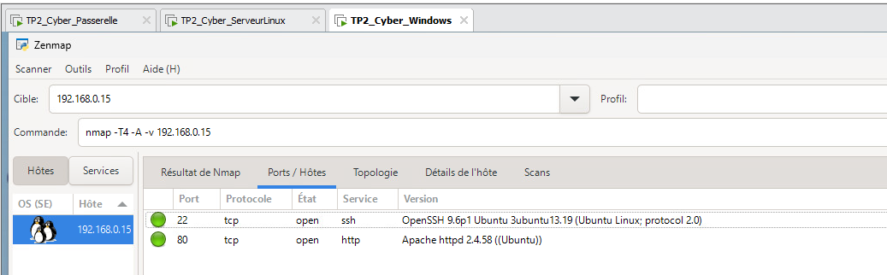
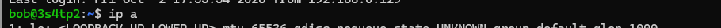
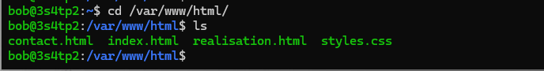
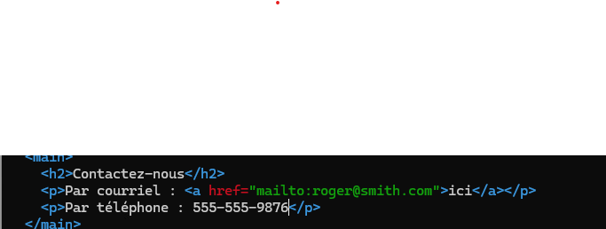

# TP2 Cybersécurité
- Nom: (Lucresse Jouonang Kwagwe)
- Matricule: (6301154)
- Groupe: (1010)

## Attaque (exploit)

Voici les étapes détaillées pour pouvoir modifier le courriel / téléphone sur la page demandée:

### Étape 1
En entrant l'adresse Ip du serveur linux dans nmap j'ai pu voir tout les prts ouverts notament le 22 pour ssh 

### Étape 2
Je nme suis connectée ensuite en ssh par ligne de commande a son compte avec cette commande ssh bob@192.168.0.15 et avec l'indice du mot de passe j'ai essayé tout les cas possible et j'ai trouvé Sophie2012!

et j'ai pu me connecter 

### Étape 3
- Une fois sur son compte je me suis déplacée dans le fichier html avec la commande cd /var/www/html et j'ai pu voir tout les fichiers du site : 

- J'ai donc pu entrer et modifier  le fichier contact.html avec la commande nano et modifier le numéro de téléphone 

### ....

dabos
exploit2fix

## Correctif 1

Commandes à effectuer ou étapes à mettre en place. 

Capture d'écran de l'exploit qui ne fonctionne plus.

## Correctif 2

Commandes à effectuer ou étapes à mettre en place.

Capture d'écran de l'exploit qui ne fonctionne plus. 

## Correctif 3

Commandes à effectuer ou étapes à mettre en place. 

Capture d'écran de l'exploit qui ne fonctionne plus.
